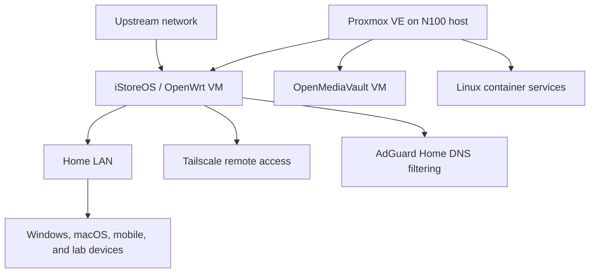

# Homelab and Network Lab

This repository presents a personal network and systems environment built around an Intel N100 x86 host. It focuses on the architecture and technologies of systems that I maintain myself.

## Architecture

## Environment

- Proxmox VE virtualization on an N100 x86 system
- An iStoreOS/OpenWrt routing environment with DHCP, NAT, and IPv4/IPv6 configuration
- AdGuard Home for DNS filtering
- Tailscale remote access, including subnet routing, exit-node use, and access-control settings
- OpenMediaVault and Linux container services
- SSH and command-line administration for deployment, routine maintenance, and configuration validation

## Repository Scope

- `architecture.md` - hardware, virtual machines, and service relationships
- `configuration/` - sanitized configuration patterns and design decisions
- `operations/` - maintenance notes and validation procedures
