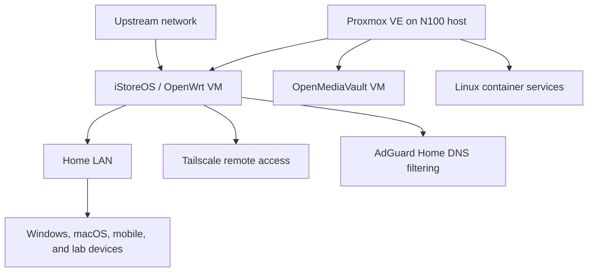

# Homelab and Network Lab

This repository documents a personal network and systems environment built around an Intel N100 x86 host. It records the architecture, configuration decisions, tests, and troubleshooting lessons from systems that I operate myself.

## Architecture

The diagram is intentionally simplified and contains no public IP addresses, credentials, device identifiers, or other secrets.

## What I Configured and Maintained

- Proxmox VE virtualization on an N100 x86 system
- An iStoreOS/OpenWrt routing environment with DHCP, NAT, and IPv4/IPv6 configuration
- AdGuard Home for DNS filtering and name-resolution troubleshooting
- Tailscale remote access, including subnet routing, exit-node use, and access-control settings
- OpenMediaVault and Linux container services
- SSH and command-line administration for configuration changes and verification

## Network Changes and Troubleshooting

- Migrated the routing environment from a PPPoE connection to an upstream DHCP network.
- Isolated DNS and host-specific connectivity problems by comparing behavior across devices and checking local configuration.
- Investigated an issue where one Windows host could not reach a website while other devices could, then traced the cause to a local hosts-file override.
- Checked iStoreOS/OpenWrt release and architecture compatibility before changing package feeds and verified the result from the command line.

## Performance Validation

I test throughput, loaded latency, jitter, and packet loss against more than one server so that a single result is not mistaken for the capacity of the network. In one environment, observed throughput reached approximately 2.15 Gbps download and 1.76 Gbps upload; results varied by server and route.

## Documentation Plan

- `architecture.md` - hardware, virtual machines, and service relationships
- `changes/` - sanitized change notes and validation steps
- `troubleshooting/` - symptoms, scope, checks, root cause, and resolution
- `tests/` - sanitized performance-test methods and results

## Security and Attribution

This repository will not include authentication keys, public IP addresses, Wi-Fi credentials, private DNS data, certificates, or complete exported configurations.

Some documentation and scripts may be drafted or refined with AI assistance. I review and adapt that material, and the deployments, configuration work, tests, and troubleshooting described here come from my own environment.
