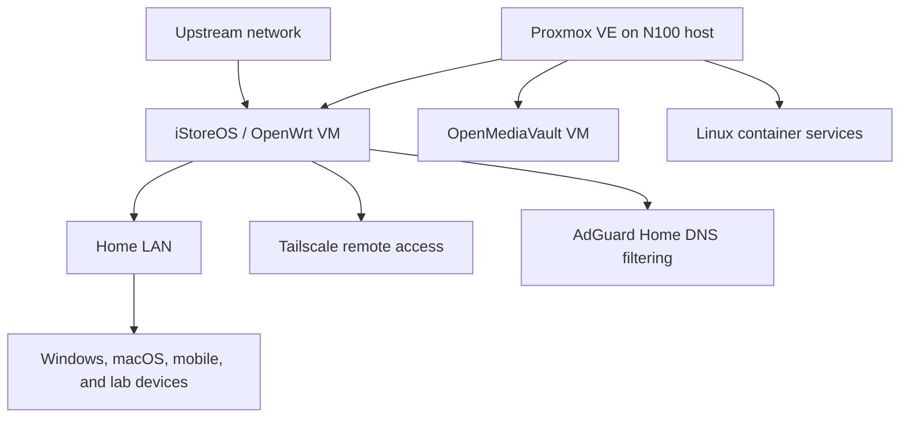

# N100 Proxmox and OpenWrt Homelab

An Intel N100-based environment for virtualization, routing, storage, DNS, remote access, and Linux services.

## Architecture

## Stack

- Proxmox VE virtualization on an N100 x86 system
- An iStoreOS/OpenWrt routing environment with DHCP, NAT, and IPv4/IPv6 configuration
- AdGuard Home for DNS filtering
- Tailscale remote access, including subnet routing, exit-node use, and access-control settings
- OpenMediaVault and Linux container services
- SSH and command-line administration for deployment, routine maintenance, and configuration validation
